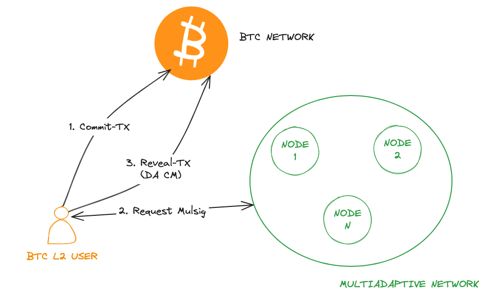

# BTCL2SendDA2MultiAdaptive
## 简介

&nbsp;&nbsp;&nbsp;&nbsp;就像铭文铸造协议（ordi）一样，用户向MultiAdaptive存储DA数据也是由两笔交易构成。第一笔为commit-tx, 此时我们会通过多签脚本(脚本中包含CM数据)构建一个taproot地址，通过commit-tx向该地址转入一定的代币。第二笔为reveal-tx, 该交易的目的是花费掉taproot地址上的utxo，因为该taproot地址是由多签脚本构建的，因此需要MultiAdaptive的多个节点为该交易提供签名。通过把CM数据写入比特币脚本，实现了CM的链上存储。

## 程序说明
这个示例程序描述了BTC L2用户使用MultiAdaptive作为DAS的详细过程。为了方便演示，我们需要提前做一些说明。
- 我们使用 bitcoin 的 regtest 网络。
- MultiAdaptive的多签节点数目为2个。
- 有些环境变量需要指定必要的值。

### 准备 btc regtest 网络环境（bitcoin 节点安装请参考它的官方文档）
- 修改 bitcoin.conf
```conf
rpcuser=multiadaptiveUser1
rpcpassword=pwd123
```
- 生成一个新的地址（BTCMINEADDR）
```sh
bitcoin-cli -regtest createwallet "test-wallet-1"
bitcoin-cli -regtest -rpcwallet=test-wallet-1 getnewaddress
bcrt1qatdxfq0ttd4kxhpxrgc07mpx2p0rpcaua26jht
```
- run bitcoind in regtest network
```sh
bitcoind -regtest -daemon -txindex -rpcbind=0.0.0.0 -rpcallowip=0.0.0.0/0
```

### 编译
```sh
make clean
make build
```

### 填写环境变量
edit test-script.sh, fill the envrionments
```
export btcRPC="http://13.228.170.151:18443/" // btc 节点 rpc
export BTCHOST="13.228.170.151:18443/wallet/test-wallet-1"
export BTCUSER="multiadaptiveUser1"
export BTCPASS="pwd123"
export BTCMINEADDR="bcrt1qatdxfq0ttd4kxhpxrgc07mpx2p0rpcaua26jht"
export MULTIADAPTIVENODERPC1="http://54.86.78.227:8545" // 第1个签名节点的rpc
export MULTIADAPTIVENODEPUBKEY1="024063dc56b68904e2f7c0e4ddee10d2da9625d4bdf2fe0002cdf381bf3d13f7cb" // 第一个签名节点公钥
export MULTIADAPTIVENODERPC2="http://54.177.13.87:8545" // 第2个签名节点的rpc
export MULTIADAPTIVENODEPUBKEY2="0398baebc991514b611a2e59b33de5a3a10b91b617e1056f1ffda4e0a7dfa6c342" // 第2个签名节点的公钥
```

### 启动脚本
```sh
./test-script.sh
```

## 关键代码
- 模拟原始数据 5MB
```go
rand.Seed(time.Now().UnixNano())
	originData := make([]byte, 1024*1024*5)
	for i := range originData {
		originData[i] = uint8(rand.Intn(256))
	}
```
- 通过kzg算法计算origindata的commitment和proof
```go
cm, proof, err := kzgsdk.GenerateDataCommitAndProof(originData)
	if err != nil {
		log.Fatalf("kzg sdk GenerateDataCommitAndProof failed, %v", err)
	}
```
- 通过origindata、commitment、proof以及签名节点信息构建ord.InscriptionRequest
```go
request := ord.InscriptionRequest{
		CommitTxOutPointList: commitTxOutPointList,
		CommitFeeRate:        200,
		FeeRate:              100,
		DataList:             dataList,
		SingleRevealTxOnly:   false,
		SignNodes:            sigNodes,
	}
```
- 多签过程由库go-ord-tx的NewInscriptionTool方法中实现，在此我们只需将构造好的ord.InscriptionRequest传入。